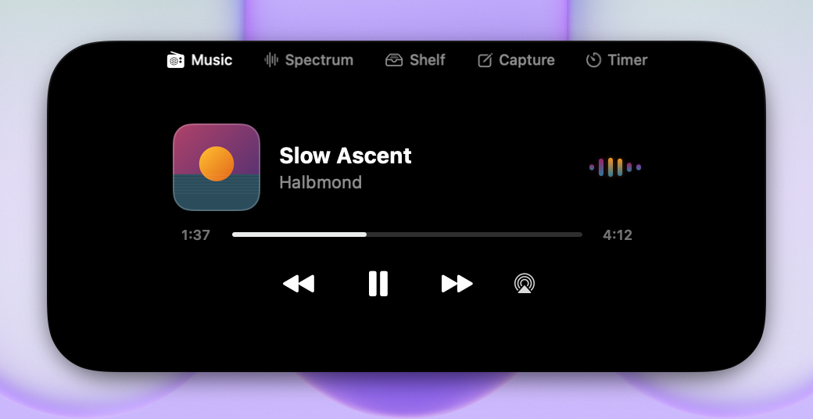
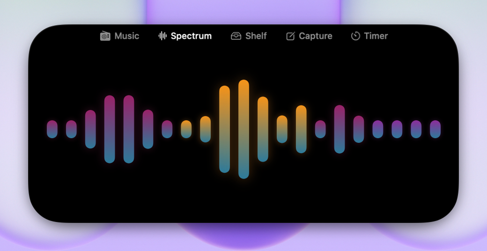
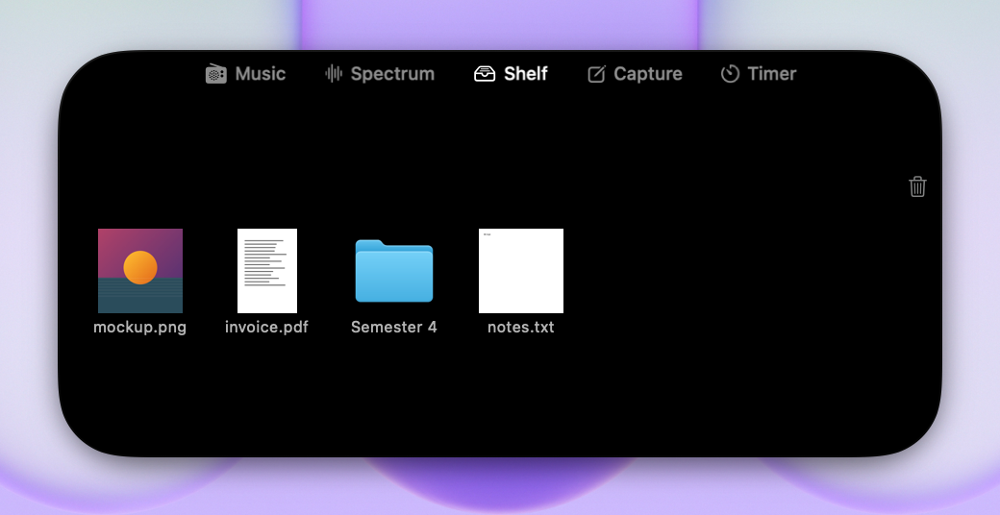
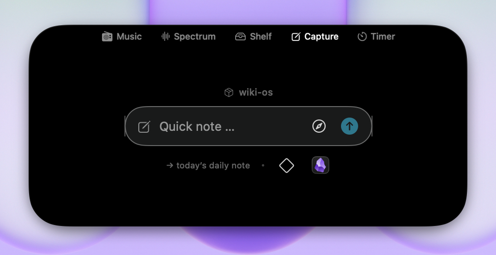
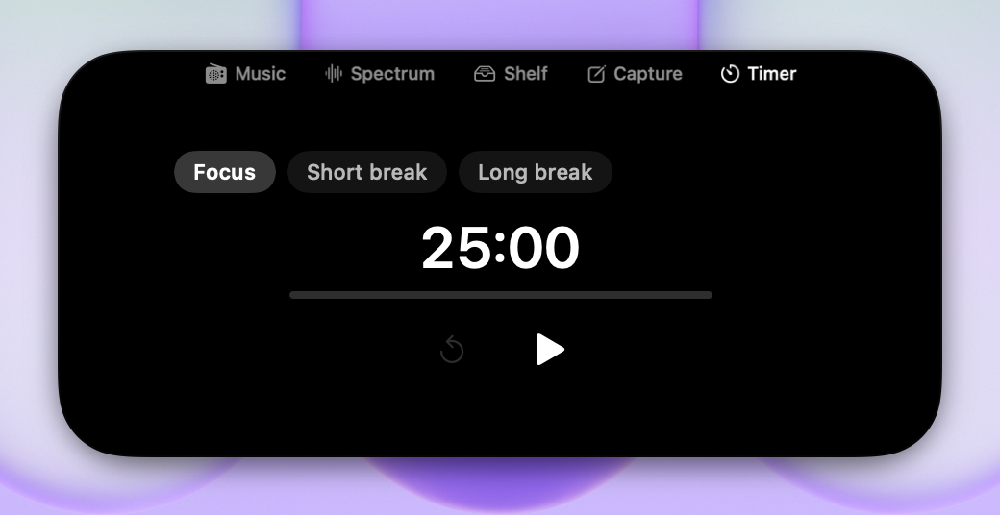
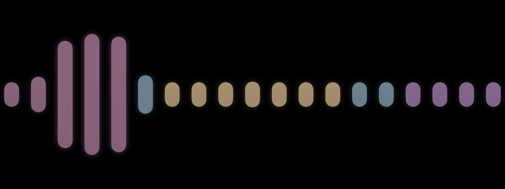
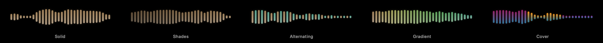
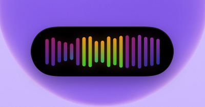

<p align="center">
  
</p>

<h1 align="center">Côte d'OS</h1>

<p align="center">Your Mac's notch, doing something other than hiding a camera.</p>

<p align="center">
  <a href="../../actions/workflows/build.yml"></a>
  <a href="../../releases/latest"></a>
  
  <a href="LICENSE"></a>
</p>

<p align="center">
  
</p>

<p align="center">
  
  <br>
  <sub>Playing, it's a pill. Idle, it's nothing at all — move the cursor up there and it fades in.</sub>
</p>

I got tired of Apple's volume HUD punching a gray box into the middle of my screen every time I hit F11, so I built something to replace it. Then I kept adding to it — now-playing controls, a real audio spectrum, a file shelf, a few things I use daily. It's a menu-bar app, no Dock icon, and it draws its own notch even on Macs that don't have a physical one. (Mine doesn't. That's an Air.)

Some of this is opinionated because I built it for myself first: the quick-capture feature assumes you're running Obsidian with daily notes, and the focus timer logs into it. If neither applies to you, the media controls, the spectrum and the file shelf don't care.

The name is a pun on Côte d'Or, and it's the third one — NotchMate was generic, Ledge somehow worse. This one stays. The coastline at the top of your OS.

## What it actually does

**Volume and brightness keys land in the notch instead of Apple's OSD.** This is the reason I open the app at all — a CGEvent tap grabs the hardware keys, CoreAudio handles the volume change directly, and Apple's overlay never shows up. Needs Accessibility permission.

**And it knows when to disappear.** With nothing playing and no timer running, the notch isn't a pill — it's gone, invisible and click-through. Move the cursor into the area it would occupy and the pill fades in; hover it (or swipe down with two fingers) and it opens. When Safari goes fullscreen its URL bar slides up right under the pill, so the pill gets out of the way: it moves next to the address field (found via the Accessibility API) and stops intercepting clicks until you leave fullscreen. What it dodges is the visible search bar, not fullscreen as such — put a video fullscreen from the page (`f` on YouTube or Twitch) and there is no toolbar to avoid, so the pill stays centred and stays interactive. Other browsers don't get this treatment yet because I don't use them fullscreen.

### Five tabs

|  |  |
|---|---|
|  | **Music** — Spotify and Apple Music: play/pause, skip, scrub, and a picker for which output device the sound goes to. Driven by AppleScript rather than MediaRemote, because Apple sealed that framework off in macOS 15.4 and broke pretty much every third-party notch app overnight. AppleScript means a refresh every 5 seconds with the position interpolated locally in between — not instant, but it survives OS updates that private APIs don't. |
|  | **Spectrum** — a real frequency spectrum of whatever your Mac is playing, from a CoreAudio process tap. 32 bands over a 2048-point FFT, not a canned animation. It taps the *processes* making sound rather than the output device, which is the difference between this working and your AirPods' stem controls breaking. |
|  | **Shelf** — drag files onto the notch, drag them off later, wherever "later" ends up being. Tracked by bookmark rather than path, so a rename or a reboot doesn't lose them, and QuickLook thumbnails are cached so the shelf doesn't regenerate them every launch. |
|  | **Capture** — ⌥⌘Space, type, and it's appended under a heading in today's daily note. Obsidian doesn't need to be running; it writes the file. There's also a button that grabs the frontmost Safari or Chrome tab as a markdown link, and one that opens a Terminal in the vault. |
|  | **Timer** — named presets with auto-chaining, because I kept starting a pomodoro in a phone app and then closing the phone app. Order the list Focus/Break and it cycles. Its readout docks onto the right of the pill while music plays: the spectrum stays exactly centred under the notch and the pill grows rightward instead of shoving everything sideways. Sessions can log to the Obsidian daily as Dataview-friendly bullets. |

Every tab can be switched off in Settings if you only came for some of this.

### The wave gets the whole screen

<p align="center">
  
</p>

⌥⌘S from anywhere, or a second swipe down on the spectrum tab, and the run grows out of the island until it fills the display. Swipe up and it plays backwards.

The part I actually built it for: **leave the Mac alone with music playing and it does this by itself**, fifteen seconds before macOS would blank the display, and holds the screen awake. Touch anything and it shrinks away — and the Mac locks behind it, because locking is the half of display-sleep behaviour it just displaced. Quitting the app while it's up locks too; that's not an escape hatch.

It's fussier than it looks, on purpose. "Audible" comes from the tap itself rather than a player's play button, so a browser video counts and a paused Spotify track with a song loaded doesn't. And if something else is already holding a display-sleep assertion — a fullscreen YouTube tab, say — it stands down rather than throwing a spectrum over your video. When an armed run ends it leaves a note in the pill saying why and when: `Input 14:02` on a Mac you left at 13:50 is somebody else.

### Five colour styles

<p align="center">
  
</p>

The last one quantises each bar onto the palette of the album-cover slice it sits over. The wave belongs to whoever is making the sound, too — a Safari video tints the bars with Safari's blue, pulled from its icon through the same colour election album art goes through, rather than borrowing the cover of whatever's paused in Spotify.

The spectrum-only pill drops the mini cover for a wider wave, with one width knob. Widening it gives you fewer, fatter bars in a taller pill — the spectrum page in miniature — rather than more hairlines:

<p align="center">
  
</p>

### Also in there

- Live-activity banners for charging, AirPods connecting (with their battery level), a file landing in the shelf, a timer finishing — a few seconds, then gone.
- Multi-monitor: the pill follows the cursor's display while collapsed.
- The pill hides itself when the frontmost app's menus reach far enough right to collide with it.
- Everything tears down on screen sleep — timers, the tap, the monitors. The idle-drain complaints against every other notch app are why.

## Requirements

- **macOS 14** for the app. **macOS 14.4** for the audio spectrum, which needs CoreAudio process taps — below that the wave falls back to a procedural animation and the spectrum tab is decoration.
- Apple Silicon. It builds for Intel and I have no Intel Mac to test on, so treat that as untested rather than supported.
- No physical notch required. It draws its own.

## Permissions

Three, asked for as you touch the features that need them, and each one is optional if you don't want that feature.

| Permission | What breaks without it | Why |
|---|---|---|
| **Automation** (Spotify, Music, Safari, Chrome, Terminal) | Media controls do nothing; browser-tab capture and the Terminal button do nothing | Apple Events are the only public way to drive these apps since MediaRemote was sealed |
| **Accessibility** | Volume/brightness keys go back to Apple's OSD; the Safari dodge stops working; the screen lock at the end of a takeover falls back to a ⌃⌘Q keystroke | A CGEvent tap to intercept the hardware keys, and AX reads to find Safari's URL field |
| **Audio Recording** | The spectrum draws its procedural fallback instead of your music | A CoreAudio process tap of the audio being played |

That last one is filed under **Privacy & Security → Audio Recording**, *not* Microphone. Resetting Microphone appears to work and changes nothing, which cost me an hour once:

```sh
tccutil reset AudioCapture com.scott.notchmate
```

## Privacy

The app makes no network requests. None — there's no analytics, no update check, no telemetry, and after the Claude tab came out in 1.5.0 there isn't a single `URLSession` call site left in the source. Grep it.

Audio is analysed in-process and never written anywhere. Captured notes go into your vault as files. Shelf entries are bookmarks on disk. Settings are in `UserDefaults`. That's the whole data story.

## Getting it running

Grab the zip from the [latest release](../../releases/latest), unzip it, drag `CoteDOs.app` into `/Applications`. (The file name skips the accents; the app presents itself as Côte d'OS. The bundle identifier and data folders still carry the app's previous names under the hood so settings and shelf data survive — plumbing, not facade.)

Gatekeeper will block the first launch — it's ad-hoc signed, since I'm not paying Apple 99 €/year to notarize a menu-bar toy. Either:

```sh
xattr -d com.apple.quarantine /Applications/CoteDOs.app
```

or let it fail once, then *System Settings → Privacy & Security → Open Anyway*.

It adds itself as a login item on first launch. If you're updating from a release whose app was called `Ledge.app` or `NotchMate.app`, delete the old one first; your settings survive, but expect macOS to ask for the permissions again — a grant follows the code signature, not the bundle identifier.

Which is also the thing that's bitten me most often: rebuild and reinstall, and macOS leaves the Accessibility checkbox *checked* in Settings while the permission underneath it is dead. If volume keys stop landing in the notch after a rebuild, remove the entry and re-add it. Don't trust the checkbox.

## Uninstalling

Delete the app, then, if you want it gone properly:

```sh
rm -rf ~/Library/Application\ Support/NotchMate ~/Library/Caches/NotchMate
defaults delete com.scott.notchmate
tccutil reset AudioCapture com.scott.notchmate
```

The login item goes with the app. Automation and Accessibility have to be removed by hand in System Settings — macOS has no CLI for revoking those.

## Building it yourself

```sh
xcodebuild -project CoteDOs.xcodeproj -scheme CoteDOs -configuration Debug build
```

Or `open CoteDOs.xcodeproj` and hit ⌘R in Xcode 16+. No SPM, no CocoaPods — everything is a system framework, so there's nothing to fetch first.

Two things worth knowing before you dig into the source. Brightness control resolves the private `DisplayServices` framework at runtime via `dlopen`, and the screen lock resolves `SACLockScreenImmediate` out of `login.framework` the same way; if Apple ever pulls those symbols, both features quietly turn themselves off and the system behaviour takes back over. That's the bargain you make with private APIs, and I'm fine with it. The app also isn't sandboxed — half of what it does (Apple Events to Spotify, a process tap of another app's audio, the CGEvent tap) isn't possible inside a container, which is also why it isn't on the Mac App Store and won't be.

The README's screenshots are generated, not captured: `COTEDOS_SHOTS=1 xcodebuild test -only-testing:CoteDOsTests/MarketingShots -testLanguage en` mounts the real views offscreen and composites them over a macOS wallpaper. Real views, real layout constants, real FFT — fake track, fake cover, fake files on the shelf.

## The icon

`swift Tools/GenerateAppIcon.swift` renders the 1024 px master with Core Graphics — no Figma file, just gradients and a couple of paths. It's a MacBook display, dark bezel, with the notch cut into the top the same way the real app's `NotchShape` does, and a small glowing waveform sitting inside it — the one thing the app is always doing somewhere, whether that's audio or a volume nudge. Style is lifted without much shame from Alcove and Dynamic Lake.

## License

[MIT](LICENSE). Do whatever you want with it.
