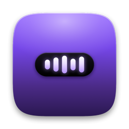
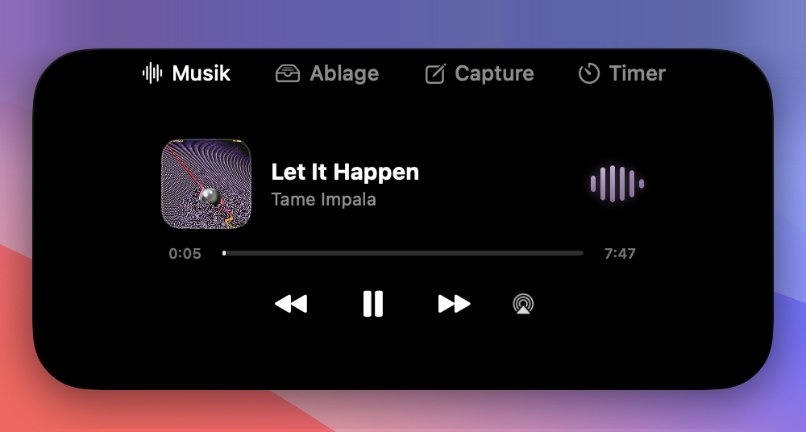

<p align="center">
  
</p>

<h1 align="center">Côte d'OS</h1>

<p align="center">Your Mac's notch, doing something other than hiding a camera.</p>

<p align="center">
  <a href="../../actions/workflows/build.yml"></a>
  <a href="../../releases/latest"></a>
  
  <a href="LICENSE"></a>
</p>

<p align="center">
  
</p>

<p align="center">
  
  <br>
  <sub>Playing, it's a pill. Idle, it's nothing at all — move the cursor up there and it fades in.</sub>
</p>

I got tired of Apple's volume HUD punching a gray box into the middle of my screen every time I hit F11, so I built something to replace it. Then I kept adding to it — now-playing controls, a file shelf, a couple of things I use daily and one I use maybe once a week. It's a menu-bar app, no Dock icon, and it draws its own notch even on Macs that don't have a physical one.

Some of this is opinionated because I built it for myself first: the UI is in German, and the quick-capture feature assumes you're running Obsidian with daily notes. If neither applies to you, the media controls and file shelf still work fine without them.

The name is a pun on Côte d'Or, and it's the third one — NotchMate was generic, Ledge somehow worse. This one stays. The coastline at the top of your OS.

## What it actually does

**Volume and brightness keys land in the notch instead of Apple's OSD.** This is the reason I open the app at all — a CGEvent tap grabs the hardware keys, CoreAudio handles the volume change directly, and Apple's overlay never shows up. Needs Accessibility permission.

**And it knows when to disappear.** With nothing playing and no timer running, the notch isn't a pill — it's gone, invisible and click-through. Move the cursor into the area it would occupy and the pill fades in; hover it (or swipe down with two fingers) and it opens. When Safari goes fullscreen its URL bar slides up right under the pill, so the pill gets out of the way: it moves next to the address field (found via the Accessibility API) and stops intercepting clicks until you leave fullscreen. What it dodges is the visible search bar, not fullscreen as such — put a video fullscreen from the page (`f` on YouTube or Twitch) and there is no toolbar to avoid, so the pill stays centred and stays interactive. Other browsers don't get this treatment yet because I don't use them fullscreen.

Beyond that:

- Now-playing for Spotify and Apple Music, driven by AppleScript rather than MediaRemote — Apple sealed that framework off in macOS 15.4, which broke pretty much every third-party notch app overnight. AppleScript means polling every 5 seconds with local interpolation in between, not instant, but it survives OS updates that private APIs don't.
- A live audio spectrum in the pill and the music tab, fed by a CoreAudio system tap — real frequencies, not a canned animation. Five color styles, including one that quantises each bar onto the album cover's own palette, and a spectrum-only mode that drops the mini cover for a bigger wave — bar count and pill width are yours to set, up to 32 bars (one per analyzer band) across 140pt.
- A file shelf. Drag files onto the notch, drag them off later, wherever "later" ends up being. Tracked by bookmark, not path, so a rename or a reboot doesn't lose them.
- Obsidian quick capture: ⌥⌘Space, type, and it's appended under a heading in today's daily note without Obsidian needing to be open. Point it at your vault in Settings first.
- A pomodoro timer with named presets and auto-chaining, because I kept starting one in a phone app and then closing the phone app. Its readout docks onto the right side of the pill while music plays — the spectrum stays exactly centered under the notch and the pill grows asymmetrically to the right instead of shoving everything sideways.
- Small live-activity banners for charging, AirPods connecting, a file landing in the shelf — a few seconds, then gone.

Every tab can be switched off in Settings if you only came for some of this.

## Getting it running

Grab the zip from the [latest release](../../releases/latest), unzip it, drag `CoteDOs.app` into `/Applications`. (The file name skips the accents; the app presents itself as Côte d'OS. The bundle identifier and data folders still carry the app's previous names under the hood so settings and shelf data survive — plumbing, not facade.)

(If you're updating from a release whose app was called `Ledge.app` or `NotchMate.app`: delete the old one, and expect macOS to ask for the Automation and Accessibility permissions again — the grant follows the app. Your settings survive; the bundle identifier deliberately stayed the same under the hood.)

Gatekeeper will block the first launch — it's ad-hoc signed, since I'm not paying Apple 99 €/year to notarize a menu-bar toy. Either:

```sh
xattr -d com.apple.quarantine /Applications/CoteDOs.app
```

or let it fail once, then *System Settings → Privacy & Security → Open Anyway*.

Needs macOS 14+. It adds itself as a login item on first launch, and asks for permissions only as you touch the features that need them: Automation the first time it talks to Spotify or Music, Accessibility if you turn on the volume-keys option.

One thing that's bitten me more than once: the Accessibility grant is tied to the app's code signature. Rebuild and reinstall from Xcode, and macOS leaves the checkbox checked in Settings while the actual permission is dead underneath it. If volume keys stop landing in the notch after a rebuild, remove the entry and re-add it — don't trust the checkbox.

## Building it yourself

```sh
xcodebuild -project CoteDOs.xcodeproj -scheme CoteDOs -configuration Debug build
```

Or `open CoteDOs.xcodeproj` and hit ⌘R in Xcode 15+. No SPM, no CocoaPods — everything is a system framework, so there's nothing to fetch first.

Two things worth knowing before you dig into the source: brightness control resolves the private `DisplayServices` framework at runtime via `dlopen`, so if Apple ever pulls those symbols the feature quietly turns itself off and the regular brightness keys take back over — that's the bargain you make with private APIs, and I'm fine with it. The app also isn't sandboxed; half of what it does (Apple Events to Spotify, raw CoreAudio, the CGEvent tap) isn't possible inside one.

## The icon

`swift Tools/GenerateAppIcon.swift` renders the 1024 px master with Core Graphics — no Figma file, just gradients and a couple of paths. It's a MacBook display, dark bezel, with the notch cut into the top the same way the real app's `NotchShape` does, and a small glowing waveform sitting inside it — the one thing the app is always doing somewhere, whether that's audio or a volume nudge. Style is lifted without much shame from Alcove and Dynamic Lake.

## License

[MIT](LICENSE). Do whatever you want with it.
